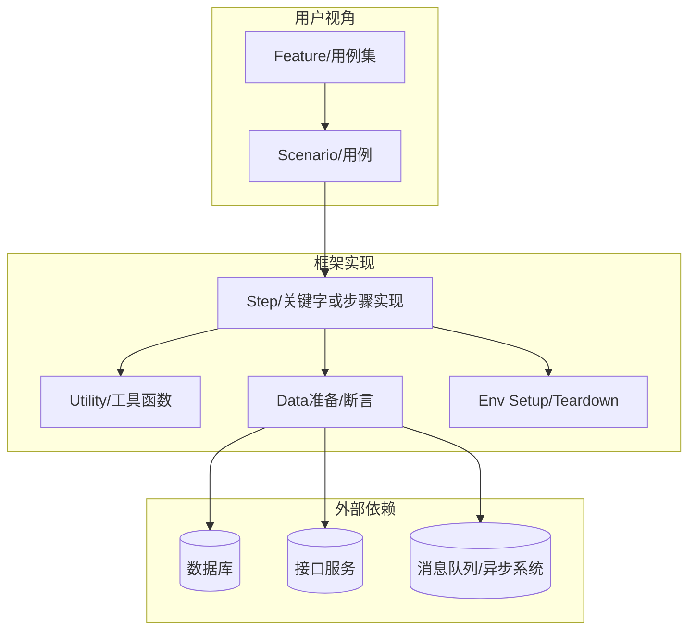
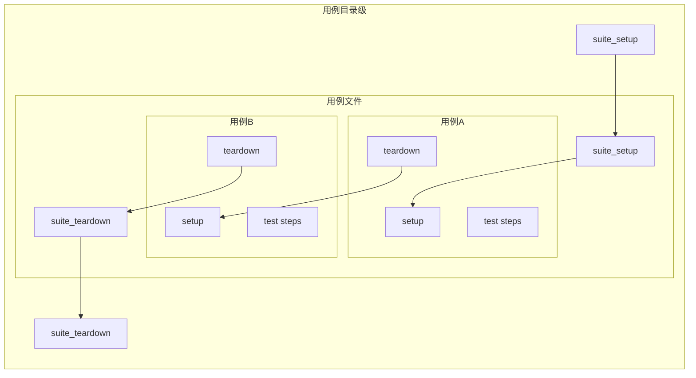
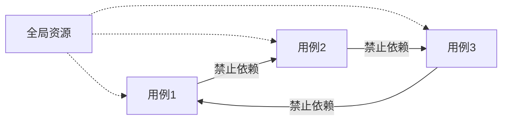
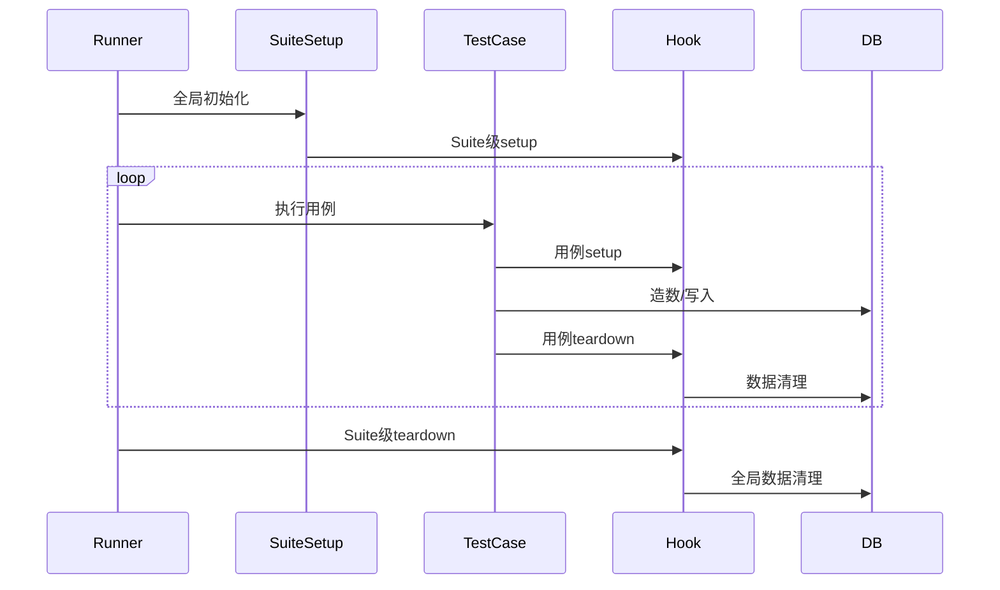
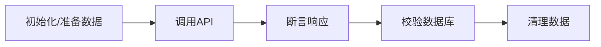
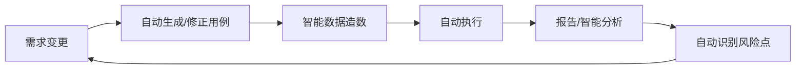

+++
title = '当我们谈论自动化时我们在谈论什么'
date = 2025-07-05T09:30:20+09:00
categories = ["diary"]
tags = ["diary", "automation"]
+++

## 1. 自动化测试的共性哲学

自动化测试不是单一框架或技术栈的选择，而是一套**让业务需求可验证、让回归可持续、让团队协作高效**的工程方法。优秀的自动化方案，必然分层清晰、职责明确，并能跨语言/跨场景适配各种用例。

### 1.1 自动化测试分层通用架构



**说明：**

- 用例与业务高度对齐
- 底层实现全模块化
- 外部依赖均可Mock/Stub，测试可控


## 2. 数据初始化、清理、共享的设计策略

### 2.1 典型生命周期管理模型

以常见的“目录-文件-用例”分层为例：



- **外层 Setup/Teardown 适合准备/清理共用资源**（如账号池、全局配置）
- **每条用例 Setup/Teardown 必须保证“谁造谁还”**，不污染全局

### 2.2 数据的生命周期

**伪代码：全局与用例级数据隔离**

```yaml
suite_setup:
    # 初始化全局账号池
    create_accounts(N)

test_case_A:
    setup:
        # 用例独占账号，造数
        user = allocate_account()
        seed_test_data(user)
    steps:
        # 执行业务步骤
        result = call_api(user)
        assert result == expected
        verify_db_state(user)
    teardown:
        # 用例独立清理
        cleanup_data(user)
        release_account(user)

test_case_B: ...
suite_teardown:
    # 删除全局账号池
    delete_all_accounts()
```

**要点：**

- “账号池”共用、用例数据独占，生命周期清晰可控。
- 所有造/删动作都可追溯，清理幂等。


## 3. 数据共享的合理姿势

### 3.1 数据复用与隔离的平衡



- 全局资源可被多用例复用，但**用例间绝不直接依赖**。
- 若需跨用例共享数据，应以**Fixture/上下文对象**形式封装，并用copy-on-write等模式保证隔离。

### 3.2 并发与冲突的伪代码设计

```python
# 并发用例时，每个用例分配唯一前缀或ID
for i in 1..N parallel:
    setup:
        prefix = generate_unique_prefix(i)
        user = create_account(prefix)
    steps:
        result = call_api(user)
        ...
    teardown:
        delete_account(user)
```


## 4. 初始化与清理的Hook模式最佳实践

### 4.1 不同层级的Hook示意



### 4.2 伪代码实现思想

```python
before_suite:
    prepare_shared_resources()
before_test:
    prepare_case_data()
after_test:
    cleanup_case_data()
after_suite:
    cleanup_shared_resources()
```

- 所有准备/清理代码均**幂等**，反复执行不会“越清越脏”
- **失败场景同样保证清理逻辑必定被调用**


## 5. 实用场景与设计建议

### 5.1 通用建议

- 所有“副作用”都应有对称的清理步骤，**不因异常而漏清**。
- 用例不能假设执行顺序，**数据不串台，运行无依赖**。
- 复杂数据建议用“快照/回滚”，极端场景下可采用“临时表/测试专用库”。

### 5.2 API 测试数据流（通用流程）




## 6. 未来自动化测试的畅想

### 6.1 自适应的数据管理

未来的自动化框架，可自动检测每条用例的“脏数据”范围，

- 用 AI 自动生成最小可用数据集
- 智能回滚所有影响
- 对所有外部依赖（API、DB、MQ等）均可Mock，生成无限制的测试空间

### 6.2 自动化赋能全流程



- 用例自动生成、数据自动准备、测试结果自动回溯业务变更，实现“质量闭环”。


## 7. 结语

> **“可控的初始化，严谨的清理，合理的数据隔离”**，是工程师团队“把复杂问题拆分到人人能搞定”的基本盘。

自动化的终极目标不是节省人力，更不是把简单的任务复杂化，而是**让每一项系统变更都有可追溯、可复现的“数字保证”**。无论最后在技术栈选型层面采用 Cucumber、Robot Framework、pytest 还是自研工具都是这样。