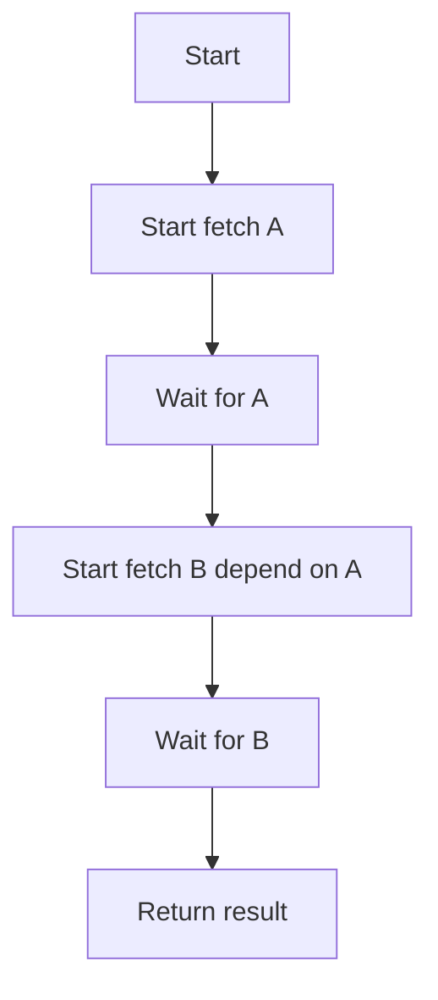
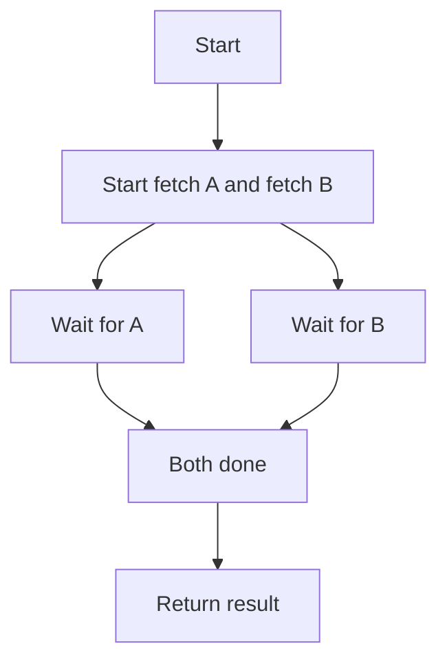

+++
title = '前端异步编程指南'
date = 2024-09-01T10:20:13+08:00
categories = ["front"]
tags = ["front", "javascript", "async"]
+++

## 背景：为什么需要异步？

首先谈一谈前端异步编程的历史背景。

JavaScript 是 [单线程](https://guyuechen.icu/posts/front/single-thread-in-js/) 执行的。这意味着一次只能做一件事，如果一段代码运行时间过长，整个页面就会“卡死”。为了保证 **页面流畅**，大多数 I/O 操作（如网络请求、定时器、文件读取等）都采用 **异步** 方式执行。

### 最初的异步：回调

早期，异步主要通过 **回调函数** 来实现。例如：

```js
setTimeout(function() {
    console.log('1秒后执行');
}, 1000);

$.ajax({
    url: '/api/data',
    success: function(data) {
        // 处理数据
    },
    error: function(err) {
        // 处理错误
    }
});
```

**问题**：

- 多重回调嵌套后，代码难以维护，出现 **“回调地狱”（Callback Hell）**
- 错误捕获和流程控制变得复杂


## 1. Promise 的由来与用法

### 1.1. Promise 的由来

Promise 最初由社区提出，并在 ES6 标准中正式纳入。它本质上是 **异步操作的状态机**，解决了回调地狱、异步流程难以组合、异常捕获困难等痛点。

#### Promise 三种状态

- Pending（进行中）
- **Fulfilled**（已成功）
- **Rejected**（已失败）

状态不可逆，且只能改变一次。

### 1.2. Promise 基础用法

#### `Promise` 实例

```js
const promise = new Promise((resolve, reject) => {
    // 异步操作
    if (/* 成功 */) {
        resolve('成功结果');
    } else {
        reject('失败原因');
    }
});
```

####  `promise.then(onFulfilled, onRejected);`

```js
var promise = new Promise((resolve, reject) => {
    resolve("传递给then的值");
});
```

创建一个promise对象。

```javascript
promise.then((value) => {
    console.log(value);
}, (error) => {
    console.error(error);
});
```

对这个 promise 对象定义了处理 onFulfilled 和 onRejected 的函数（handler）。

该对象会在变为 resolve 或者 reject 的时候分别调用相应注册的回调函数。

- 当 handler 返回一个正常值的时候，这个值会传递给 promise 对象的 onFulfilled 方法。
- 定义的 handler 中产生异常的时候，这个值则会传递给 promise 对象的 onRejected 方法。

#### `promise.catch(onRejected);`

```javascript
promise
    .then(value => console.log(value))
    .catch(error => console.error(error));
```

这是一个等价于 `promise.then(undefined, onRejected)` 的语法糖。

####  `Promise.resolve` 与 `Promise.reject`

```js
Promise.resolve(42).then(console.log);
// 控制台打印 42

Promise.reject(new Error("err")).catch(console.error);
// 这还是一个 promise 对象且是 rejected 的
```

- `Promise.resolve(p)` 直接返回 p
- `Promise.reject(p)` 总是返回一个新的 rejected promise

####  `Promise.all` 与 `Promise.race`

```js
Promise.all([p1, p2, p3]).then(values => {
    // 所有成功后返回 [v1, v2, v3]
});

Promise.race([p1, p2, p3]).then(value => {
    // 第一个 settle 的值
});
```


## 2. `async` / `await` 的由来与用法

### 2.1. `async` / `await` 的出现

随着 Promise 普及，虽然回调地狱缓解了，但 **复杂的异步流程链式调用依然冗长**，且不够直观。2017 年 ES8（ES2017）引入了 `async` / `await`，让异步代码书写方式 **几乎与同步一致**，极大提升可读性。

### 2.2. 基本用法

#### async 函数

`async` 修饰的函数默认返回一个 Promise：

```js
async function foo() {
    return 1; // 等价于 return Promise.resolve(1)
}
```

#### await 表达式

`await` **只能在 async 函数中使用**，等待一个 Promise resolve，拿到 resolve 的值：

```js
async function getData() {
    const res = await fetch('/api/data');
    const json = await res.json();
    return json;
}
```

#### 错误捕获

结合 try / catch，可优雅处理异常：

```js
async function safeRequest() {
    try {
        const res = await fetch('/api/data');
        const data = await res.json();
        return data;
    } catch (err) {
        console.error('请求失败:', err);
        // 可以选择继续 throw
    }
}
```


### 2.3. 串行与并行

#### 串行异步（等待上一步结果）

```js
async function serial() {
    const a = await fetch('/api/a');
    const b = await fetch('/api/b?ref=' + (await a).id);
    return [a, b];
}
```



> 两个请求 **不能串行发起**，`总耗时 = a耗时 + b耗时`

#### 并行异步（互不依赖，效率更高）

```js
async function parallel() {
    const [a, b] = await Promise.all([
        fetch('/api/a'),
        fetch('/api/b'),
    ]);
    return [a, b];
}
```



> a、b 两个请求 **同时并发发起**，`总耗时 = max(a耗时, b耗时)`


### 2.4. for 循环异步与最佳实践

#### 低效写法（全部串行，性能差）

```js
async function wrongLoop(arr) {
    for (let item of arr) {
        await doAsync(item);
    }
}
```

#### 高效写法（并行批量发起）

```js
async function rightLoop(arr) {
    await Promise.all(arr.map(item => doAsync(item)));
}
```

#### 补充说明

- 如果顺序强依赖，必须串行 `await`
- 如果只需全部完成，`Promise.all` 并行即可

#### 最佳实践

- 不依赖的异步任务尽量用 `Promise.all` 提高效率
- `await` 写在方法左侧是串行，`await` 写在赋值左侧（赋值的是 Promise 对象）是并行

> 以下是一种常见的串行任务写法（每次 await，等待前一步完成）

```js
async function serial() {
    const a = await fetchA(); // 只有fetchA完成后才会往下走
	const b = await fetchB(); // 等a拿到结果后，才会发起fetchB
	return [a, b];
}
```

**执行流程：**

1. 发起 fetchA()
2. **等待 fetchA 完成**，拿到结果赋值给 a
3. 发起 fetchB()
4. **等待 fetchB 完成**，拿到结果赋值给 b

> 可以改写成以下并行写法

```js
async function parallel() {
    const promiseA = fetchA(); // 立即发起
    const promiseB = fetchB(); // 立即发起
    const a = await promiseA;  // 等promiseA完成
    const b = await promiseB;  // 等promiseB完成
    return [a, b];
}
```

**执行流程：**

1. 发起 fetchA()，得到 promiseA
2. 发起 fetchB()，得到 promiseB
3. **此时 fetchA 和 fetchB 已经同时在跑了**
4. await promiseA 和 await promiseB 只是等待各自的 Promise 完成
5. 两个请求是**同时进行**的

> 或者直接更简洁：

```js
const [a, b] = await Promise.all([fetchA(), fetchB()]);
```


### 2.5. `async` / `await` 的局限

- 不能直接捕获顶层未处理的 promise reject（需 try / catch 或 catch）
- 多层 await 串行会有性能损失
- 并发控制、超时处理需要手动实现

#### 更细粒度的并发控制

比如有 100 个任务要处理，但只允许最多并发 5 个：

```js
async function asyncPool(limit, arr, iteratorFn) {
    const ret = [];
    const executing = [];
    for (const item of arr) {
        const p = Promise.resolve().then(() => iteratorFn(item));
        ret.push(p);

        if (limit <= arr.length) {
            const e = p.then(() => executing.splice(executing.indexOf(e), 1));
            executing.push(e);
            if (executing.length >= limit) {
                await Promise.race(executing);
            }
        }
    }
    return Promise.all(ret);
}

// 使用示例
await asyncPool(5, tasks, task => fetchTask(task));
```

**解释**：

- `executing` 数组记录当前并发中的 Promise
- 超过最大数量时，`await Promise.race(executing)` 等待最早完成的一个
- **这样 JS 代码手动控制最大并发数**

#### 利用工具函数超时处理

Promise 本身没有内置超时。需要结合 `Promise.race` 手动实现：

```js
function fetchWithTimeout(promise, ms) {
    const timeout = new Promise((_, reject) => 
        setTimeout(() => reject(new Error('Timeout')), ms)
    );
    return Promise.race([promise, timeout]);
}

// 用法
try {
    const data = await fetchWithTimeout(fetch('/api/data'), 1000);
    console.log(data);
} catch (err) {
    console.error('请求超时或失败:', err);
}
```

**原理**：

- `Promise.race` 谁先完成用谁，fetch 超时就会抛错
- 这是“手动实现”超时


## 3. `Promise` 与 `async` / `await` 的实践建议

- **推荐优先用 `async` / `await`**，搭配 try / catch，使异步逻辑结构清晰
- 多个异步任务可用 `Promise.all` 批量并行，提高效率
- 针对异步异常，**务必捕获处理**，避免“未捕获 Promise 错误”导致页面崩溃
- 注意 async 函数返回值始终是 Promise，调用方要用 await 或 then 获取结果


## 4. 总结

### 😈 回调地狱

```js
getData(function(res1) {
    getMore(res1, function(res2) {
        getFinal(res2, function(res3) {
            // do something
        });
    });
});
```

### 👻 `Promise` 优化

```js
getData()
    .then(res1 => getMore(res1))
    .then(res2 => getFinal(res2))
    .then(res3 => {
        // do something
    })
    .catch(err => {
        // 错误集中处理
    });
```

### 😇 `async` / `await` 极简重写

```js
async function main() {
    try {
        const res1 = await getData();
        const res2 = await getMore(res1);
        const res3 = await getFinal(res2);
        // do something
    } catch (err) {
        // 错误处理
    }
}
```


## 5. 参考文献

- [JavaScript Promise迷你书](http://liubin.org/promises-book)
- [MDN - Promise](https://developer.mozilla.org/zh-CN/docs/Web/JavaScript/Reference/Global_Objects/Promise)
- [MDN - async/await](https://developer.mozilla.org/zh-CN/docs/Web/JavaScript/Reference/Statements/async_function)
- [异步编程: 一次性搞懂 Promise, async, await (#js #javascript) - Bilibili 视频](https://www.bilibili.com/video/BV1WP4y187Tu/?spm_id_from=333.337.search-card.all.click&vd_source=6f178e5bb1d1bb35491b6cee8bc840e8)
