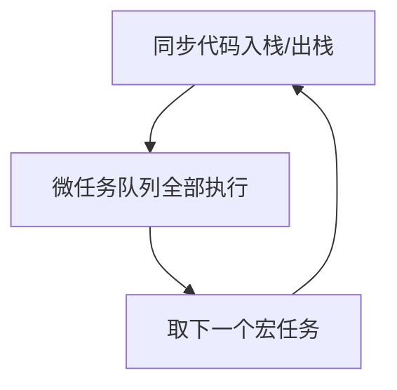
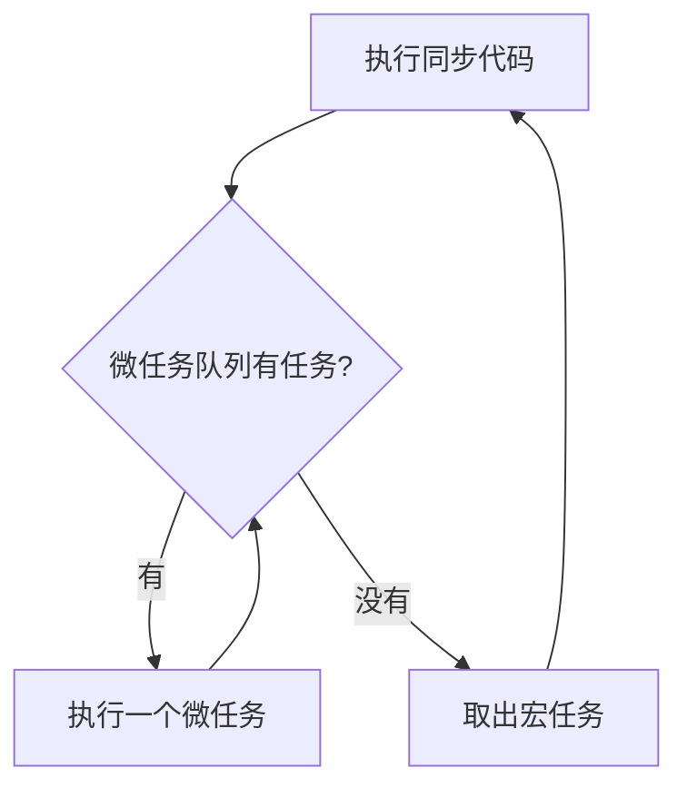

+++
title = 'JavaScript的单线程与异步的本质'
date = 2025-06-07T13:34:06+09:00
categories = ["front"]
tags = ["front","javascript"]

+++

## 1. 为什么 JavaScript 是单线程？

JavaScript 诞生于 1995 年 Netscape 浏览器，为了解决**网页的交互需求**。

JavaScript 的设计初衷是操作网页（DOM），单线程可以避免多个线程同时操作页面导致的竞态和一致性问题。这也决定了 JS**只能同时做一件事**。

**核心设计目标**：

- 操作 DOM，保证**渲染过程一致性**
- 容易实现，减少并发带来的“竞态、死锁、线程安全”等问题

**单线程的好处：**

- 编码简单，开发者不用担心两个线程同时读写 DOM
- 避免了同步、加锁等复杂机制
- 性能损耗更小（线程切换/调度成本低）

**单线程的局限：**

- 一次只能做一件事，阻塞任务会导致页面卡死
- 不能直接利用多核 CPU 做并行计算


## 2. 异步的本质：事件循环（Event Loop）

JavaScript 通过**事件循环机制**实现异步。JS 引擎本身只有一个主线程（执行栈），但浏览器（或 Node.js）环境在底层配合有任务队列与事件触发：

- **主线程**：执行同步代码
- **任务队列**（Task Queue）：存放待执行的异步回调（如 setTimeout、Promise.then、I/O 完成等）
- **事件循环**（Event Loop）：主线程空闲时，不断检查任务队列，将回调取出并执行

### 直观图示（伪代码流程）


**执行顺序——核心原则：**

1. 同步代码先执行
2. 处理所有微任务队列（Promise.then/catch/finally）
3. 取出下一个宏任务，回到第1步


## 3. 事件循环执行流程与实验



**更详细的典型流程：**



------

### 2.1 宏任务与微任务的实际表现

#### 宏任务（Macro Task）

- setTimeout/setInterval
- I/O 回调
- UI 渲染/事件
- script（整体脚本执行）

#### 微任务（Micro Task）

- Promise.then/catch/finally
- MutationObserver
- queueMicrotask

**微任务总是优先于宏任务调度。**

不妨做个实验：

```js
console.log('script start');

setTimeout(() => {
  console.log('setTimeout');
}, 0);

Promise.resolve().then(() => {
  console.log('promise1');
}).then(() => {
  console.log('promise2');
});

console.log('script end');
```

**输出顺序：**

```powershell
script start
script end
promise1
promise2
undefined   ← 控制台回显返回值（同步结束）
setTimeout
```

**解释：**

- 同步代码先执行
- 所有微任务（promise1、promise2）在 setTimeout 前全部执行完


### 与 Java 多线程的本质区别

|          | JavaScript                 | Java 多线程                    |
| -------- | -------------------------- | ------------------------------ |
| 并发方式 | 单线程 + 事件循环          | 多线程 (多CPU核心并行)         |
| 任务调度 | 由事件循环与任务队列驱动   | 由 OS 线程调度（抢占/协作式）  |
| 内存隔离 | 单线程无并发共享问题       | 线程间需同步/锁                |
| 常见异步 | I/O、定时器、Promise       | 线程、线程池、Future、Executor |
| 并行能力 | 真正并行需借助 Web Worker  | 多线程可并行                   |
| 编码模式 | Promise、async/await、回调 | synchronized、Future、Lock     |


## 结论

- JavaScript 异步 = “伪并发”，单线程保证安全，事件循环负责调度。
- Java 真正多线程 = “真并发”，线程间数据同步复杂。


## 延伸阅读

- [MDN：Concurrency model and Event Loop](https://developer.mozilla.org/zh-CN/docs/Web/JavaScript/EventLoop)

- [MDN：Web Workers](https://developer.mozilla.org/zh-CN/docs/Web/API/Web_Workers_API)

- [MDN：SharedArrayBuffer 和 Atomics](https://developer.mozilla.org/zh-CN/docs/Web/JavaScript/Reference/Global_Objects/SharedArrayBuffer)

- [You-Dont-Know-JS: Async & Performance](https://github.com/getify/You-Dont-Know-JS/blob/2nd-ed/async %26 performance/ch1.md)

