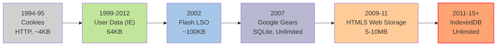
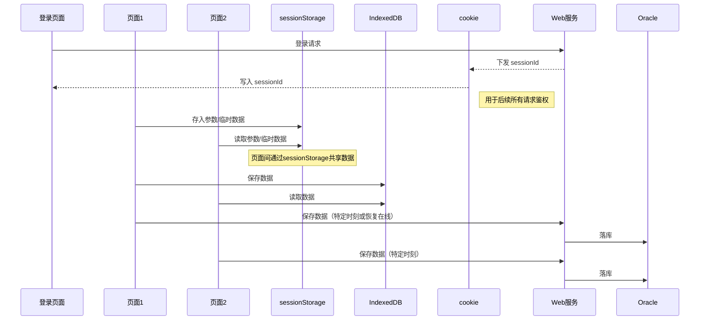

+++
title = '浏览器存储'
date = 2024-09-01T10:17:54+08:00
categories = ["front"]
tags = ["front","javascript"]

+++

## 前言

通常我们认为只有服务器端才涉及到数据持久化，才会和数据库打交道，实际上，随着现代浏览器的功能不断增强，以及 HTML5 的普及，越来越多的网站开始考虑，将大量数据储临时或永久地存储在客户端，这样可以减少网络开销，提升交互速度。

对于我们的日常开发，尤其是前端程序员来说，尤为重要。

本次，就将包括 HTML5 的新特性的一些关于浏览器端的本地存储相关的常用解决方案或策略做一下梳理，帮助大家对其概念的理解以及使用方法的掌握。


## 请考虑以下功能需求

- 开发一个基于Session的认证模块
- 开发一个基于token的认证模块
- 在各个Web页面之间实现数据的临时传递
- 当网络在Offline的情况下，依旧能够通过我们的系统录入/保存数据，并在Online的时候同步到DB中


## 何为“本地”存储

这里所说本地存储特指浏览器端存数据持久化，即将数据临时或永久保存到浏览器端的能力，说白了就是将数据存储到本地，在需要的时候进行调用。

比如我们熟知的 Cookie，在 HTML5 标准中，又新加入了 WebStorage 的特性，另外还有 IndexedDB，它们一起强化了浏览器端的存储能力。


## 发展历程



本次将介绍以下几本种常见的解决方案：

- **Cookie**
- **WebStorage**
- IndexedDB


## Cookie

Cookie，即 HTTP Cookie，是服务器发送到用户浏览器（或使用 JS 在浏览器端做成）的一小块数据。浏览器会存储 cookie 并在下次向同一服务器再发起请求时携带并发送到服务器上。通常，它用于告知服务端两个请求是否来自同一浏览器（保持用户的登录状态）。Cookie 使基于无状态 [1] 的 HTTP 协议记录稳定的状态信息成为了可能。

[1] : http 的每一次请求都是一次全新的，独立的请求,服务器不保存该客户端已经登录过的状态。


- Cookie只适合存储很小的数据（最大为4KB）；
- Cookie数据**始终**在同源的请求中携带（即使不需要）；
- Cookie可以设置过期时间，其在过期时间之前一直有效，即使窗口或浏览器关闭；
- Cookie受同源策略的限制；
- Cookie通常用于保存用户登录状态，跟踪用户行为，创建购物车；

如何查看 Cookie？以 Chrome 为例如下所示：


------

```javascript
// 设置 cookie
function setCookie(name, value, exdays = 7) {
  const d = new Date();
  d.setTime(d.getTime() + (exdays * 24 * 60 * 60 * 1000));
  const expires = "expires=" + d.toUTCString();
  document.cookie =
    encodeURIComponent(name) + "=" + encodeURIComponent(value) +
    "; " + expires + "; path=/";
}

// 获取 cookie
function getCookie(name) {
  const pattern = new RegExp('(?:^|; )' + encodeURIComponent(name) + '=([^;]*)');
  const match = document.cookie.match(pattern);
  return match ? decodeURIComponent(match[1]) : null;
}

// 删除 cookie
function clearCookie(name) {
  setCookie(name, "", -1);
}
```


## WebStorage

Web Storage API 使浏览器能以一种比使用 Cookie 更直观的方式存储键值对。

- WebStorage 包含两种机制：**sessionStorage** 和 **localStorage**，他们拥有相同的API；
- sessionStorage 为每一个给定的源提供一个独立的存储区域，该存储区域**在会话结束前即浏览器（也包括Tab页）关闭前可用**（即只要浏览器处于打开状态，包括页面刷新），当页面被关闭时，存储在 sessionStorage 的数据会被清除；
- localStorage 拥有和sessionStorage同样的功能，但是比起sessionStorage，**它的数据是永久保存的，即使关闭浏览器**，下次打开同源窗口（也包括Tab页）依然可用；
- WebStorage 在不同的浏览器之间无法共享，即使是同一个页面；
- `a target="_blank"`, `window.location.href`，`window.open` 打开新的页面时，新页面会复制父页面的 sessionStorage，但它们是相互独立的，不互相影响；
- **键值对总是以字符串的形式存储**（JSON需要转换成字符串）；
- WebStorage的api调用是**同步**的，对其他的操作，如画面渲染会造成阻塞；
- 受同源策略的限制；
- 相较Cookie，WebStorage的API接口使用更方便；
- sessionStorage适用于同源页面直接的数据传递；
- 相较于sessionId存放到Cookie，Token信息更多的时候是放在WebStorage中的；

------

```javascript
// 增/改
sessionStorage.setItem('key', 'value');
// 支持对象存储
sessionStorage.setItem('user', JSON.stringify({ id: 1, name: 'Tom' }));

// 查
let val = sessionStorage.getItem('key'); // 原始值
let user = JSON.parse(sessionStorage.getItem('user') || 'null'); // 对象

// 是否存在
function hasSessionKey(key) {
  return sessionStorage.getItem(key) !== null;
}

// 删
sessionStorage.removeItem('key');
sessionStorage.clear();
```


## IndexedDB

IndexedDB是HTML5规范里新加入的一组底层 API，用于在浏览器端存储大量的结构化数据。

- 通俗的讲，IndexedDB就是浏览器提供的一个本地数据库，可以被网页脚本创建和操作；
- 它更接近于NoSQL数据库，与关系型数据库比较，NoSQL数据库适用于数据模型简单，高并发的读写需求；
- IndexedDB的存储空间是没有限制的(取决于本地硬盘的容量)，可以解决localStorage存储空间受限的问题；
- IndexedDB API大部分都是异步的，在使用异步方法的时候，API不会立马返回要查询的数据，而是返回一个callback，减少了阻塞，提升了用户体验；
- IndexedDB 内部采用对象仓库（object store）存放数据，相当于表的概念。包括 JavaScript 对象，所有类型的数据都可以直接存入。对象仓库中，数据以"键值对"的形式保存；
- 支持事务（transaction），事务的提交时自动完成的，无需手动提交；
- 支持二进制数据的存储；
- 支持基于索引的高性能查询；
- IndexedDB受同源策略的限制，每个源都会关联到不同的数据库集合，不同源之间无法互访数据；
- IndexedDB 使得数据的保存不受网络的限制，适用于Offline期间的数据保存；


### 基本的使用模式

```javascript
// 打开数据库
function openDB(name = 'localDB', version = 1) {
  return new Promise((resolve, reject) => {
    if (!window.indexedDB) {
      reject('当前浏览器不支持 IndexedDB');
      return;
    }
    const request = indexedDB.open(name, version);
    request.onerror = () => reject('数据库打开失败');
    request.onsuccess = () => resolve(request.result);
    request.onupgradeneeded = (event) => {
      const db = event.target.result;
      if (!db.objectStoreNames.contains('task')) {
        const store = db.createObjectStore('task', { keyPath: 'id' });
        store.createIndex('idxName', 'name', { unique: false });
      }
    };
  });
}

// 添加数据
function addTask(db, data) {
  return new Promise((resolve, reject) => {
    const tx = db.transaction(['task'], 'readwrite');
    const store = tx.objectStore('task');
    const req = store.add(data);
    req.onsuccess = () => resolve();
    req.onerror = () => reject('插入数据失败');
  });
}

// 查询数据
function getTaskById(db, id) {
  return new Promise((resolve, reject) => {
    const req = db.transaction(['task'], 'readonly')
      .objectStore('task').get(id);
    req.onsuccess = () => resolve(req.result);
    req.onerror = () => reject('读取失败');
  });
}
```


### 常用的第三方库

- localForage：一个简单的 Polyfill，提供了简单的客户端数据存储的值语法。它在后台使用 IndexedDB，并在不支持 IndexedDB 的浏览器中回退到 WebSQL 或 localStorage。
- Dexie.js：IndexedDB 的包装，通过简单的语法，可以更快地进行代码开发。
- ZangoDB：类似 MongoDB 的 IndexedDB 接口，支持 MongoDB 的大多数熟悉的过滤、投影、排序、更新和聚合功能。
- JsStore：一个带有 SQL 语法的 IndexedDB 包装器。
- MiniMongo：由 localstorage 支持的客户端内存中的 mongodb，通过 http 进行服务器同步。MeteorJS 使用 MiniMongo。

参考网站：[IndexedDB API - Web APIs | MDN](https://developer.mozilla.org/en-US/docs/Web/API/IndexedDB_API)


### `demo.html`

```html
<!doctype html>
<html lang="zh-CN">
<head>
  <meta charset="utf-8">
  <title>IndexedDB DEMO</title>
  <style>
    body { font-family: system-ui, sans-serif; }
    #dataArea { margin: 10px 0; border: 1px black solid; border-radius: 5px; padding: 20px; width: 600px; }
    li { margin: 12px; border-bottom: 1px solid #ccc; }
    .controls { margin: 10px 0; }
    label { margin-right: 8px; }
    input[type="text"] { width: 100px; height: 22px; margin-right: 8px; }
    input[type="button"] { width: 120px; height: 32px; margin: 4px 6px 0 0; }
  </style>
  <script>
    // 全局 db 实例
    let db = null;
    const DB_NAME = 'localDB', STORE_NAME = 'task', DB_VERSION = 1;

    // 浏览器兼容性判断
    function isSupported() {
      if (!window.indexedDB) {
        alert("当前浏览器不支持 IndexedDB!");
        return false;
      }
      return true;
    }

    // 打开/新建数据库
    function openDB() {
      if (!isSupported()) return;
      const request = indexedDB.open(DB_NAME, DB_VERSION);
      request.onerror = () => alert('数据库打开失败');
      request.onsuccess = () => {
        db = request.result;
        alert('数据库已成功打开');
      };
      request.onupgradeneeded = (event) => {
        db = event.target.result;
        if (!db.objectStoreNames.contains(STORE_NAME)) {
          const store = db.createObjectStore(STORE_NAME, { keyPath: 'id' });
          store.createIndex('idxName', 'name', { unique: false });
        }
      };
    }

    function closeDB() {
      if (db) {
        db.close();
        db = null;
        alert('数据库已关闭');
      }
    }

    function deleteDB() {
      closeDB();
      const req = indexedDB.deleteDatabase(DB_NAME);
      req.onsuccess = () => alert('数据库已删除');
      req.onerror = () => alert('删除数据库失败');
    }

    // 通用事务获取
    function getStore(mode = 'readonly') {
      if (!db) { alert('请先打开数据库'); return null; }
      return db.transaction([STORE_NAME], mode).objectStore(STORE_NAME);
    }

    function getInputData() {
      return {
        id: document.getElementById('id').value.trim(),
        name: document.getElementById('name').value.trim(),
        content: document.getElementById('content').value.trim(),
      };
    }

    // 增
    function add() {
      const data = getInputData();
      const store = getStore('readwrite');
      if (!store) return;
      const req = store.add(data);
      req.onsuccess = () => alert('插入数据成功');
      req.onerror = (e) => alert('插入失败，主键可能已存在');
    }

    // 改
    function updateData() {
      const data = getInputData();
      const store = getStore('readwrite');
      if (!store) return;
      const req = store.put(data);
      req.onsuccess = () => alert('数据更新成功');
      req.onerror = () => alert('数据更新失败');
    }

    // 查 - 主键
    function read() {
      clearList();
      const id = document.getElementById('id').value.trim();
      if (!id) { alert('请输入编号'); return; }
      const store = getStore();
      if (!store) return;
      const req = store.get(id);
      req.onsuccess = (e) => {
        if (req.result) render(req.result);
        else alert('无此编号数据');
      };
      req.onerror = () => alert('读取失败');
    }

    // 查 - 索引
    function readByIndex() {
      clearList();
      const name = document.getElementById('name').value.trim();
      if (!name) { alert('请输入名称'); return; }
      const store = getStore();
      if (!store) return;
      const idx = store.index('idxName');
      const req = idx.getAll(name);
      req.onsuccess = () => {
        if (req.result && req.result.length) {
          req.result.forEach(render);
        } else {
          alert('无匹配数据');
        }
      };
      req.onerror = () => alert('读取失败');
    }

    // 查 - 所有
    function readAll() {
      clearList();
      const store = getStore();
      if (!store) return;
      const req = store.openCursor();
      req.onsuccess = (e) => {
        const cursor = e.target.result;
        if (cursor) {
          render(cursor.value);
          cursor.continue();
        } else if (!document.getElementById('dataArea').hasChildNodes()) {
          alert('没有任何数据');
        }
      };
    }

    // 删
    function remove() {
      const id = document.getElementById('id').value.trim();
      if (!id) { alert('请输入编号'); return; }
      const store = getStore('readwrite');
      if (!store) return;
      const req = store.delete(id);
      req.onsuccess = () => alert('数据已删除');
      req.onerror = () => alert('删除失败');
    }

    // 清空 UI 列表
    function clearList() {
      document.getElementById('dataArea').innerHTML = '';
    }

    // 渲染数据到 UI
    function render(obj) {
      const li = document.createElement('li');
      li.textContent = `编号：${obj.id}　名称：${obj.name}　内容：${obj.content}`;
      document.getElementById('dataArea').appendChild(li);
    }
  </script>
</head>
<body>
  <h2>IndexedDB DEMO</h2>
  <div class="controls">
    <label>编号:</label><input type="text" id="id" placeholder="主键id">
    <label>名称:</label><input type="text" id="name" placeholder="姓名">
    <label>内容:</label><input type="text" id="content" placeholder="内容">
  </div>
  <div>
    <input type="button" value="打开/新建数据库" onclick="openDB()">
    <input type="button" value="关闭数据库" onclick="closeDB()">
    <input type="button" value="删除数据库" onclick="deleteDB()">
    <input type="button" value="插入数据" onclick="add()">
    <input type="button" value="更新数据" onclick="updateData()">
    <input type="button" value="删除数据" onclick="remove()">
    <input type="button" value="检索数据" onclick="read()">
    <input type="button" value="索引检索" onclick="readByIndex()">
    <input type="button" value="列出所有数据" onclick="readAll()">
  </div>
  <ul id="dataArea"></ul>
</body>
</html>
```


## 比较

|                  | Cookie 会话级                     | Cookie 持久级                | sessionStorage                | localStorage               | IndexedDB                  |
| ---------------- | --------------------------------- | ---------------------------- | ----------------------------- | -------------------------- | -------------------------- |
| 存储大小         | 4KB                               | 4KB                          | 5MB                           | 5MB                        | 无限制（取决于硬盘大小）   |
| 存储位置         | 浏览器运行内存                    | 硬盘                         | 浏览器运行内存                | 硬盘                       | 硬盘                       |
| 创建位置         | 服务器端或浏览器端                | 服务器端或浏览器端           | 浏览器端                      | 浏览器端                   | 浏览器端                   |
| 生命周期         | 浏览器（不包括Tab页）关闭即被清除 | 设置过期时间，到期后清除     | 浏览器（包括Tab页）关闭即清除 | 永久保存，手动或者程序清除 | 永久保存，手动或者程序清除 |
| 与服务器端的交互 | 每次请求都会携带                  | 每次请求都会携带             | 否                            | 否                         | 否                         |
| 访问策略         | 同源、当前路径及子路径可访问      | 同源、当前路径及子路径可访问 | 同源可访问                    | 同源可访问                 | 同源可访问                 |
| 操作：同步/异步  | 同步                              | 同步                         | 同步                          | 同步                       | 异步                       |
| 适用场景         | 基于Session的认证                 | 基于Session的认证            | 页面之间的参数传递、Token信息 | Token信息                  | 离线存储、PWA              |


## 案例介绍


### 业务场景分析

**典型应用举例**

- **企业表单/流程录入系统**（如工单填报、报销审批、复杂数据采集）
- **离线Web应用**（如PWA、现场填报系统、移动办公）
- **页面间状态共享且需数据安全与可靠同步**的应用

**场景推测**

- 用户在浏览器中**登录后**，会在多个页面（画面1/画面2等）中填报、处理、保存数据。
- 由于有**sessionStorage、IndexedDB、cookie**等协同，系统支持：
  - 页面之间的参数传递
  - 临时数据保存、断网后重连同步
  - 跨Tab或离线多次编辑
- 有部分数据**必须和服务器交互**（如认证、最终数据落库），其它数据**临时存储在本地**。

### 各类前端存储的定位与优劣互补

**存储类型分层作用**

| 存储                        | 主要作用                      | 场景用途                          |
| --------------------------- | ----------------------------- | --------------------------------- |
| sessionStorage              | **会话/页面级数据临时传递**   | 多个页面参数传递/同一会话数据缓存 |
| IndexedDB                   | **持久、结构化本地存储**      | 离线保存、复杂对象、高可靠性需求  |
| cookie                      | **与后端的登录/身份状态同步** | 认证/权限/sessionId 传递          |
| WebStorage（session/local） | **前端数据临时/持久存储**     | 页面状态、Token、表单草稿等       |

**这样设计的原因**

- **sessionStorage** 能在同一会话中高效、临时传递参数，避免因刷新或关闭页面导致状态丢失。
- **IndexedDB** 可异步、大容量、结构化存储，适合“断网-重连”后数据批量同步，避免数据丢失。
- **cookie** 仅用作后端会话认证（如 sessionId），安全受控，避免大数据泄漏风险。
- 前端所有“操作数据/读取数据”都不依赖服务器实时返回，提高了交互体验。
- 支持**离线编辑**，并可“特定时刻同步到后端数据库”，提升健壮性。

### 架构时序（Mermaid 序列图）

> **流程简要描述：**
>
> - 用户登录，拿到 `sessionId`（cookie）。
> - 业务数据操作都用 WebStorage（sessionStorage/IndexedDB），多页面协作通过 WebStorage 共享。
> - 定时/用户操作时同步数据到服务器，再落库到 Oracle。



### 核心代码片段

页面间数据传递（**sessionStorage**）

```js
// 页面1：设置参数
sessionStorage.setItem('formParams', JSON.stringify(formData));

// 页面2：读取参数
const params = JSON.parse(sessionStorage.getItem('formParams') || '{}');
```

本地离线数据持久化（**IndexedDB**，简化版）

```js
// 存数据
async function saveRecord(data) {
  const db = await openDB();
  const tx = db.transaction('records', 'readwrite');
  await tx.objectStore('records').put(data);
  await tx.done;
}

// 取数据
async function loadRecords() {
  const db = await openDB();
  return await db.getAll('records');
}
```

与后端同步（带 **cookie**）

```js
fetch('/api/save', {
  method: 'POST',
  headers: {
    'Content-Type': 'application/json'
    // cookie 自动随请求携带，无需手动设置
  },
  body: JSON.stringify(localData)
}).then(resp => resp.json());
```

### 设计优势

**总结**

- **多页面参数同步**：sessionStorage 简化了页面间状态传递。
- **离线能力+大容量**：IndexedDB 持久存储断网/异常情况下的数据，保证数据安全。
- **用户体验佳**：表单自动保存、本地编辑、随时同步、断网也不怕。
- **安全合规**：敏感身份只存在 cookie，其他数据前端隔离管理。
- **可扩展性强**：适用于 PWA/复杂表单/离线应用等新一代 Web 系统。

**这种模式特别适合**

- **PWA（渐进式Web应用）**
- **现场采集/移动办公**
- **大表单/流程型录入**
- **需要断点续传/断网保护的应用**