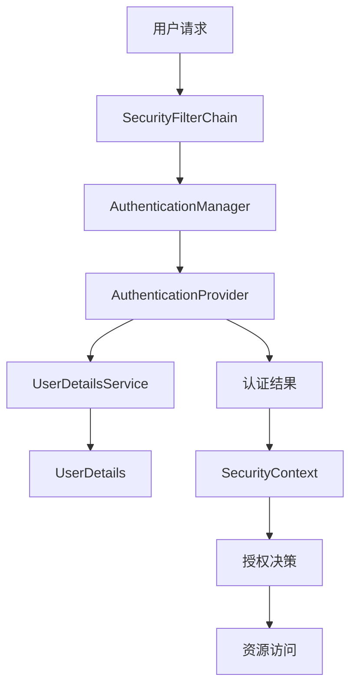
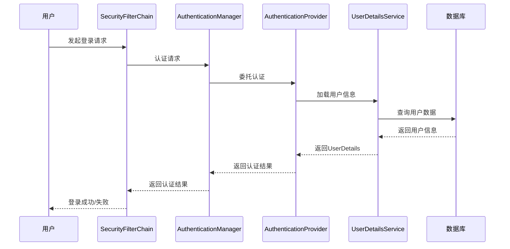

+++
title = 'SpringSecurity详解与核心类分析'
date = 2025-07-22T19:00:00+08:00
categories = ['java', 'framework']
tags = ['Spring', 'Security', 'Java']
+++


## 简介

Security 是 Spring 生态中用于认证与授权的安全框架，广泛应用于企业级 Java Web 项目。它通过一系列过滤器和核心组件，实现了灵活且强大的安全控制。

在现代应用中，安全不仅仅是登录和权限校验，更包括会话管理、攻击防护（如 CSRF/XSS）、细粒度授权、第三方登录集成等。Spring Security 提供了高度可扩展的架构，支持自定义认证流程、权限模型和安全策略。

## 核心功能

- 用户认证（Authentication）
- 权限授权（Authorization）
- 防止跨站请求伪造（CSRF）
- 会话管理与并发控制
- 密码加密与存储（推荐使用 BCrypt）
- 集成 OAuth2、JWT、LDAP、CAS 等现代认证协议
- 细粒度方法级安全（@PreAuthorize/@Secured）
- 资源访问控制（URL、方法、对象级）
- 安全事件监听与审计

## 认证与授权流程图



## 关键类详解

### 1. `SecurityFilterChain`

`SecurityFilterChain` 是 Spring Security 的过滤器链接口，负责定义安全过滤器的顺序和逻辑。每个 HTTP 请求都会经过该链中的多个过滤器，如 `UsernamePasswordAuthenticationFilter`、`BasicAuthenticationFilter`、`ExceptionTranslationFilter`、`FilterSecurityInterceptor` 等。

每个过滤器负责不同的安全职责：
- 认证过滤器（如 `UsernamePasswordAuthenticationFilter`）处理登录请求。
- 授权过滤器（如 `FilterSecurityInterceptor`）判断用户是否有权限访问资源。
- 异常处理过滤器（如 `ExceptionTranslationFilter`）负责安全异常的捕获和响应。

```java
@Bean
public SecurityFilterChain filterChain(HttpSecurity http) throws Exception {
    http
        .authorizeHttpRequests(authz -> authz
            .anyRequest().authenticated()
        )
        .formLogin();
    return http.build();
}
```

### 2. `AuthenticationManager`

`AuthenticationManager` 是认证的核心接口，负责处理用户的认证请求。常见实现为 `ProviderManager`，它会委托多个 `AuthenticationProvider` 进行认证。

在自定义登录流程、集成第三方认证（如 OAuth2、JWT）时，通常会扩展或自定义 `AuthenticationManager`。

```java
@Autowired
private AuthenticationManager authenticationManager;

public void authenticateUser(String username, String password) {
    UsernamePasswordAuthenticationToken token = new UsernamePasswordAuthenticationToken(username, password);
    Authentication auth = authenticationManager.authenticate(token);
    // ...处理认证结果
}
```

### 3. `UserDetails` & `UserDetailsService`

`UserDetails` 是用户信息的抽象接口，包含用户名、密码、权限、账号状态等。`UserDetailsService` 用于加载用户数据，通常从数据库或远程服务获取。

自定义用户体系时，需实现这两个接口，支持多种认证方式（如手机号、邮箱、第三方账号）。

实战建议：
- 用户表建议设计字段：用户名、密码（加密）、状态、角色、权限、最后登录时间等。
- 密码存储推荐使用 BCrypt 加密，避免明文或弱加密。

```java
public class CustomUserDetails implements UserDetails {
    // ...实现方法
}

@Service
public class CustomUserDetailsService implements UserDetailsService {
    @Override
    public UserDetails loadUserByUsername(String username) throws UsernameNotFoundException {
        // ...从数据库加载用户
    }
}
```

### 4. `AuthenticationProvider`

`AuthenticationProvider` 用于具体的认证逻辑，如校验用户名密码、短信验证码、第三方令牌等。可自定义实现以支持多种认证方式。

常见场景：
- 多因子认证（如密码+短信验证码）
- 集成 OAuth2/JWT/LDAP 等协议
- 支持自定义异常和认证流程

```java
@Component
public class CustomAuthenticationProvider implements AuthenticationProvider {
    @Override
    public Authentication authenticate(Authentication authentication) throws AuthenticationException {
        // ...自定义认证逻辑
    }
    @Override
    public boolean supports(Class<?> authentication) {
        return UsernamePasswordAuthenticationToken.class.isAssignableFrom(authentication);
    }
}
```

### 5. `GrantedAuthority`

`GrantedAuthority` 表示用户的权限，通常为角色（如 `ROLE_ADMIN`）或操作标识（如 `READ_PRIVILEGE`）。`UserDetails` 中的 `getAuthorities()` 方法返回该集合。

权限设计建议：
- 角色与权限分离，支持细粒度授权。
- 可结合 Spring Security 的注解（如 `@PreAuthorize("hasRole('ADMIN')")`）实现方法级安全。

```java
public Collection<? extends GrantedAuthority> getAuthorities() {
    return Arrays.asList(new SimpleGrantedAuthority("ROLE_USER"));
}
```

## 认证与授权流程示意图



## 配置示例

```java
@Configuration
@EnableWebSecurity
public class SecurityConfig {
    @Bean
    public SecurityFilterChain filterChain(HttpSecurity http) throws Exception {
        http
            .authorizeHttpRequests(authz -> authz
                .antMatchers("/admin/**").hasRole("ADMIN")
                .anyRequest().authenticated()
            )
            .formLogin()
            .and()
            .csrf().disable();
        return http.build();
    }
}
```

## 实战建议与最佳实践

- 强制使用 HTTPS，防止敏感信息泄露。
- 所有密码存储均采用 BCrypt 加密。
- 开启 CSRF 防护，防止跨站请求伪造。
- 对敏感接口（如用户管理、支付）增加多因子认证。
- 日志与审计：记录登录、权限变更、异常等安全事件。
- 定期安全测试与漏洞扫描。

## 总结

Spring Security 通过一系列核心类和接口，实现了灵活的安全控制。开发者可根据实际需求扩展认证方式、权限模型，保障应用安全。

通过合理设计认证流程、权限模型和安全策略，结合 Spring Security 的强大扩展能力，可以有效提升应用的安全性和可维护性。
