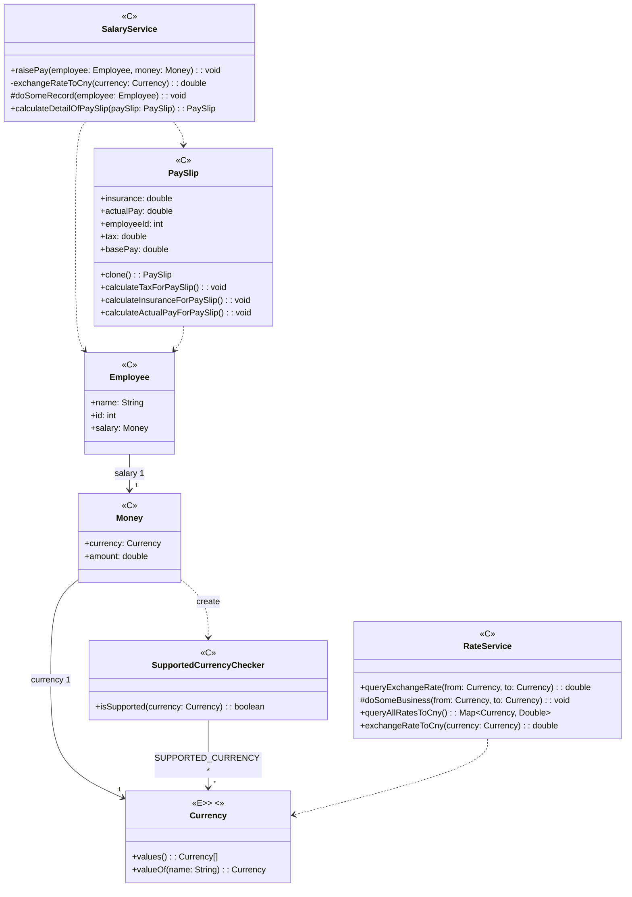

+++
title = '代码坏味道之霰弹式修改 (Shotgun Surgery)'
date = 2024-10-02T19:50:46+08:00
categories = ['java']
tags = ['refactor']
+++

**定义**

霰弹式修改指的是：如果每遇到某种变化，你都必须在许多不同的类内做出许多小修改。

**影响**

- 需要修改的代码散布四处，你不但很难找到它们，也很容易错过某个重要的修改。任何修改遗漏都会导致异常结果。

**改进目标**

- 更好的代码组织
- 更少的代码重复
- 更易维护

**方法**

- 搬移函数
- 搬移字段
- 函数组合成类
- 函数组合成变换
- 拆分阶段
- 内联函数
- 内联类

> 案例：某跨国公司员工的薪资管理




> “霰弹式修改”有哪些表现？

**场景一：增加一个币种**

1. Currency中增加一种货币类型；
2. 修改SupportedCurrencyChecker类中SUPPORTED_CURRENCY属性；
3. RateService中汇率相关转换方法适配新增货币类型；
4. SalaryService中汇率相关转换方法适配新增货币类型。

增加币种这种变化我们需要在4个类中分别进行适配。

**场景二：货币汇率变化**

1. RateService中汇率分别修改方法queryAllRatesToCny及exchangeRateToCny方法中各币种对应的汇率值
2. SalaryService中修改exchangeRateToCny方法中各币种对应的汇率值

汇率变化时我们需要在2个类中分别进行适配

> 改进手法：搬移字段

将SupportedCurrencyChecker中的内容搬移到Currency中，SupportedCurrencyChecker之后安全删除

```java
/**
 * 币种
 */
public enum Currency {
    CNY,
    USD,
    GBP,
    BTC;

    // 下面都是从SupportedCurrencyChecker中新搬移过来的
    private final static List<Currency> SUPPORTED_CURRENCY = Arrays.asList(CNY, USD, GBP);

    /**
     * 校验是否支持输入的币种
     */
    public boolean isSupported() {
        return SUPPORTED_CURRENCY.contains(this);
    }
}
```

> 改进手法：搬移方法

将RateService中的部分内容搬移到Currency，并且消除原先的魔鬼数字

```java
/**
 * 币种
 */
public enum Currency {
    CNY,
    USD,
    GBP,
    BTC;

    // 从SupportedCurrencyChecker中搬移过来的
    private final static List<Currency> SUPPORTED_CURRENCY = Arrays.asList(CNY, USD, GBP);

    // 下面都是从RateService中搬移过来的, 消除了魔鬼数字
    public static final double RATE_CNY = 1.0;

    public static final double RATE_USD_TO_CNY = 6.8;

    public static final double RATE_GBP_TO_CNY = 9.6;

    public static final double RATE_BTC_TO_CNY = 60000.0;

    public static Map<Currency, Double> getCurrencyDoubleMap() {
        Map<Currency, Double> map = new HashMap<>();
        map.put(CNY, RATE_CNY);
        map.put(USD, RATE_USD_TO_CNY);
        map.put(GBP, RATE_GBP_TO_CNY);
        map.put(BTC, RATE_BTC_TO_CNY);
        return map;
    }

    // 从SupportedCurrencyChecker中搬移过来的
    /**
     * 校验是否支持输入的币种
     */
    public boolean isSupported() {
        return SUPPORTED_CURRENCY.contains(this);
    }

    // 下面都是从RateService中搬移过来的
    /**
     * 转换为兑人民币汇率
     *
     * @return 汇率
     */
    private double exchangeRateToCny() {
        switch (this) {
            case CNY:
                return RATE_CNY;
            case USD:
                return RATE_USD_TO_CNY;
            case GBP:
                return RATE_GBP_TO_CNY;
            case BTC:
                return RATE_BTC_TO_CNY;
            default:
                throw new IllegalArgumentException(MessageFormat.format("unsupported exchange {0} to CNY", this));
        }
    }

    public double exchangeRate(Currency to) {
        return exchangeRateToCny() / to.exchangeRateToCny();
    }
}
```

> 改进手法：拆分阶段

一段代码在同时处理两件或两件以上不同的事，可以 把它拆分成各自独立的模块，因为这样到了需要修改的时候，就可以单独处理每个主题，而不必同时在脑 子里考虑两个不同的主题。

原先的SalaryService

```java
/**
 * 薪资管理
 */
public class SalaryService {
    /**
     * 计算工资单详情
     *
     * @param paySlip 工资单
     * @return 工资单
     */
    public PaySlip calculateDetailOfPaySlip(PaySlip paySlip) {
        paySlip.calculateTaxForPaySlip();
        paySlip.calculateInsuranceForPaySlip();
        paySlip.calculateActualPayForPaySlip();
        return paySlip;
    }

    /**
     * 员工涨薪
     *
     * @param employee 员工
     * @param increase 涨薪幅度
     */
    public void raisePay(Employee employee, Money increase) {
        if (employee.getSalary().getAmount() > 30000) {
            throw new IllegalArgumentException("salary is too high, not support");
        }
        if (increase.getAmount() > 5000) {
            throw new IllegalArgumentException("money is beyond max range");
        }

        final Money originalSalary = employee.getSalary();
        final double rate = exchangeRateToCny(increase.getCurrency()) / exchangeRateToCny(originalSalary.getCurrency());
        final double finalSalary = originalSalary.getAmount() + increase.getAmount() * rate;
        final Money resultSalary = new Money(finalSalary, originalSalary.getCurrency());
        employee.setSalary(resultSalary);

        doSomeRecord(employee);
    }

    /**
     * 转换为兑人民币汇率
     *
     * @param from 转换币种
     * @return 汇率
     */
    private double exchangeRateToCny(Currency from) {
        switch (from) {
            case CNY:
                return 1.0;
            case USD:
                return 6.8;
            case GBP:
                return 9.6;
            case BTC:
                return 60000.0;
            default:
                throw new IllegalArgumentException(MessageFormat.format("unsupported exchange {0} to CNY", from));
        }
    }

    private void doSomeRecord(Employee employee) {
        // save to database
    }
}
```

修改后的SalaryService

```java
/**
 * 薪资管理
 */
public class SalaryService {
    /**
     * 计算工资单详情
     *
     * @param paySlip 工资单
     * @return 工资单
     */
    public PaySlip calculateDetailOfPaySlip(PaySlip paySlip) {
        return paySlip.enrichPaySlip();
    }

    /**
     * 员工涨薪
     *
     * @param employee 员工
     * @param increase 涨薪幅度
     */
    public void raisePay(Employee employee, Money increase) {
        doSomeCheck(employee, increase);

        raise(employee, increase);

        doSomeRecord(employee);
    }

    private void raise(Employee employee, Money increase) {
        final Money originalSalary = employee.getSalary();
        final Money resultSalary = originalSalary.add(increase);
        employee.setSalary(resultSalary);
    }

    private void doSomeCheck(Employee employee, Money increase) {
        if (employee.getSalary().getAmount() > 30000) {
            throw new IllegalArgumentException("salary is too high, not support");
        }
        if (increase.getAmount() > 5000) {
            throw new IllegalArgumentException("money is beyond max range");
        }
    }

    private void doSomeRecord(Employee employee) {
        // save to database
    }
}
```

> 改进手法：函数组合变换

把函数组合起来的原因之一，是为了避免计算派生数据的逻辑到处重复（把所有计算派生数据的逻辑收拢到一处，这样始终可以在固定的地方找到和更新这些逻辑，避免到处重复）
原先的PaySlip

```java
/**
 * 薪资单
 *
 * @author z00602558
 * @since 2021-11-16
 */
public class PaySlip implements Cloneable {
    private final int employeeId;

    private final double basePay;

    private double actualPay;

    private double tax;

    private double insurance;

    public PaySlip(int employeeId, double basePay) {
        this.employeeId = employeeId;
        this.basePay = basePay;
    }

    /**
     * 计算纳税额
     */
    public void calculateTaxForPaySlip() {
        final double base = this.getBasePay();
        final double tax = Math.max(0, (base - 5000) * 0.2);
        setTax(tax);
    }

    /**
     * 计算五险一金
     */
    public void calculateInsuranceForPaySlip() {
        final double base = this.getBasePay();
        final double insurance = base * 0.08;
        setInsurance(insurance);
    }

    /**
     * 计算实发工资
     */
    public void calculateActualPayForPaySlip() {
        final double base = this.getBasePay();
        final double tax = Math.max(0, (base - 5000) * 0.2);
        final double insurance = base * 0.08;
        double actualPay = base - tax - insurance;
        setActualPay(actualPay);
    }

    public int getEmployeeId() {
        return employeeId;
    }

    public double getBasePay() {
        return basePay;
    }

    public double getActualPay() {
        return actualPay;
    }

    public void setActualPay(double actualPay) {
        this.actualPay = actualPay;
    }

    public double getTax() {
        return tax;
    }

    public void setTax(double tax) {
        this.tax = tax;
    }

    public double getInsurance() {
        return insurance;
    }

    public void setInsurance(double insurance) {
        this.insurance = insurance;
    }

    @Override
    public PaySlip clone() {
        try {
            return (PaySlip) super.clone();
        } catch (CloneNotSupportedException e) {
            throw new IllegalArgumentException("CloneNotSupportedException for money");
        }
    }
}
```

修改后的PaySlip

```java
/**
 * 薪资单
 *
 * @author z00602558
 * @since 2021-11-16
 */
public class PaySlip implements Cloneable {
    private final int employeeId;

    private final double basePay;

    private double actualPay;

    private double tax;

    private double insurance;

    public PaySlip(int employeeId, double basePay) {
        this.employeeId = employeeId;
        this.basePay = basePay;
    }

    public int getEmployeeId() {
        return employeeId;
    }

    public double getBasePay() {
        return basePay;
    }

    public double getActualPay() {
        return actualPay;
    }

    public double getTax() {
        return tax;
    }

    public double getInsurance() {
        return insurance;
    }

    @Override
    public PaySlip clone() {
        try {
            return (PaySlip) super.clone();
        } catch (CloneNotSupportedException e) {
            throw new IllegalArgumentException("CloneNotSupportedException for money");
        }
    }

    public PaySlip enrichPaySlip() {
        final PaySlip clonePaySlip = clone();
        final double base = clonePaySlip.getBasePay();
        final double tax = Math.max(0, (base - 5000) * 0.2);
        final double insurance = base * 0.08;
        double actualPay = base - tax - insurance;
        clonePaySlip.insurance = insurance;
        clonePaySlip.tax = tax;
        clonePaySlip.actualPay = actualPay;
        return clonePaySlip;
    }
}
```


> 操作手法

| 操作                  | 快捷键（推荐） | Ctrl+Alt+Shift+T（或：鼠标右键“Refactor”） |
| --------------------- | -------------- | ------------------------------------------ |
| 提炼常量              | Ctrl+Atl+C     | Introduce Constant                         |
| 提炼函数              | Ctrl+Alt+M     | Extract Method                             |
| 搬移实例方法/静态成员 | F6             | Move Instance Method/Move Static Members   |
| 内联                  | Ctrl+Alt+N     | Inline XXX                                 |

补充：可以用Idea：Analyze->Inspect Code 分析Duplicated code fragment 片段
