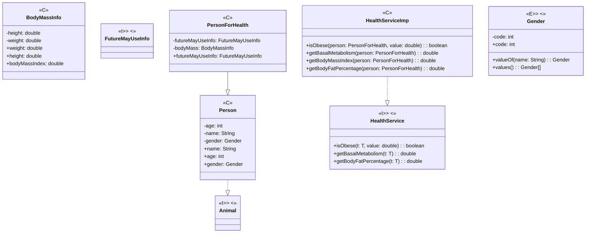
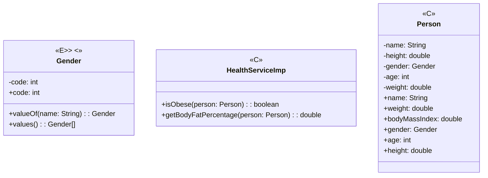

+++
title = '代码坏味道之夸夸其谈的通用性 (Speculative Generality)'
date = 2024-10-13T18:28:36+08:00
categories = ['java']
tags = ['refactor']
+++

**定义**

过度的考虑程序的通用性

**影响**

- 过度的设计导致代码不易理解和维护

**改进目标**

- 删除过度设计的代码

**方法**

- 折叠继承体系
- 内联类/函数
- 改变函数声明
- 移除死代码

> 案例1：问题代码

**代码背景1**

- 这是一个计算人的体脂比以及判断是否肥胖的需求的实现
- Person类用来记录人的各种数据
- HealthService类根据人的数据计算体脂比以及判断是否肥胖
- 考虑到未来可能不止计算健康信息，专门抽取了一个人的基础信息类Person，健康相关类再有一个单独的类PersonForHealth来承担
- 又考虑到以后可能不止计算人的，抽取一个Animal接口作为 泛型参数传进去
- 考虑到不止有体重相关的这些指标，又做了一个futureMayUseInfo接口，便于未来扩展

**症状/问题1**

代码中出现了很多过度设计：

- HealthService、Animal、FutureMayUseInfo都是不必要的接口
- 没有必要抽取Person抽象类
- 没有必要使用泛型

```java
/**
 * 健康指标计算服务
 */
public class HealthServiceImp implements HealthService<PersonForHealth> {
    @Override
    public double getBodyFatPercentage(PersonForHealth person) {
        double bodyFatPercentage =
            1.2 * getBodyMassIndex(person) + 0.23 * person.getAge() - 5.4 - 10.8 * person.getGender().getCode();
        return BigDecimal.valueOf(bodyFatPercentage).setScale(1, RoundingMode.HALF_UP).doubleValue();
    }

    @Override
    public boolean isObese(PersonForHealth person, double waistHipRatio) {
        double bodyFatPercentage = getBodyFatPercentage(person);
        if (person.getGender().equals(Gender.FEMALE) && bodyFatPercentage >= 32) {
            return true;
        }
        return person.getGender().equals(Gender.MALE) && bodyFatPercentage >= 25;
    }

    private double getBodyMassIndex(PersonForHealth person) {
        return person.getBodyMass().getBodyMassIndex();
    }

    @Override
    public double getBasalMetabolism(PersonForHealth person) {
        double basalMetabolism;
        if (person.getGender().equals(Gender.FEMALE)) {
            basalMetabolism = 665.1 + 9.6 * person.getBodyMass().getWeight() + 180 * person.getBodyMass().getHeight()
                - 4.7 * person.getAge();
        } else {
            basalMetabolism = 66.5 + 13.8 * person.getBodyMass().getWeight() + 500 * person.getBodyMass().getHeight()
                - 6.8 * person.getAge();
        }
        return BigDecimal.valueOf(basalMetabolism).setScale(1, RoundingMode.HALF_UP).doubleValue();
    }
}
```

```java
/**
 * 健康指标计算服务接口
 */
public interface HealthService<T extends Animal> {
    /**
     * 根据BMI指数、年龄和性别估算体脂比
     * 
     * @return 体脂比,单位%
     */
    double getBodyFatPercentage(T animal);

    /**
     * 根据体脂比和性别判断是否肥胖
     * 
     * @return 是否肥胖
     */
    boolean isObese(T animal, double waistHipRatio);

    /**
     * 根据性别、年龄、身高和体重计算的基础代谢量
     * 
     * @param animal person
     * @return 基础代谢量，单位kcal
     */
    double getBasalMetabolism(T animal);
}
```

```java
/**
 * 人员健康信息
 */
public class PersonForHealth extends Person {
    private final BodyMassInfo bodyMassInfo;

    private final FutureMayUseInfo futureMayUseInfo;

    public PersonForHealth(String name, int age, Gender gender, BodyMassInfo bodyMassInfo,
        FutureMayUseInfo futureMayUseInfo) {
        super(name, age, gender);
        this.bodyMassInfo = bodyMassInfo;
        this.futureMayUseInfo = futureMayUseInfo;
    }

    /**
     * 获取身高体重相关信息
     * 
     * @return 身高体重相关信息
     */
    public BodyMassInfo getBodyMass() {
        return bodyMassInfo;
    }

    public FutureMayUseInfo getFutureMayUseInfo() {
        return futureMayUseInfo;
    }
}
```

```java
/**
 * 人员信息
 */
public abstract class Person implements Animal {
    private final String name;

    private final int age;

    private final Gender gender;

    public Person(String name, int age, Gender gender) {
        this.name = name;
        this.age = age;
        this.gender = gender;
    }

    public String getName() {
        return name;
    }

    public int getAge() {
        return age;
    }

    public Gender getGender() {
        return gender;
    }
}

/**
 * 性别
 */
public enum Gender {
    FEMALE(0),
    MALE(1);

    private final int code;

    Gender(int code) {
        this.code = code;
    }

    public int getCode() {
        return code;
    }
}
```

```java
/**
 * 动物接口
 */
public interface Animal {
}
```

```java
/**
 * 未来可能会用到的扩展信息
 */
public interface FutureMayUseInfo {
}
```

> 改进手法1：折叠继承体系，删除不必要的接口和抽象类

**代码背景2**

- PersonForHealth类有个BodyMassInfo属性，记录身高、体重，可以获取人的BMI指标

**症状/问题2**

代码中出现了很多过度设计：

- BodyMassInfo类的只是获取BMI指标，属性也比较固定没有必要单独作为一个类
- getBodyMassIndex不用单独作为函数

```java
public class PersonForHealth extends Person {
    private final BodyMassInfo bodyMassInfo;

    private final FutureMayUseInfo futureMayUseInfo;

    public PersonForHealth(String name, int age, Gender gender, BodyMassInfo bodyMassInfo,
        FutureMayUseInfo futureMayUseInfo) {
        super(name, age, gender);
        this.bodyMassInfo = bodyMassInfo;
        this.futureMayUseInfo = futureMayUseInfo;
    }

    /**
     * 获取身高体重相关信息
     * 
     * @return 身高体重相关信息
     */
    public BodyMassInfo getBodyMass() {
        return bodyMassInfo;
    }

    public FutureMayUseInfo getFutureMayUseInfo() {
        return futureMayUseInfo;
    }
}
```

```java
/**
 * 身高体重相关信息处理
 */
public class BodyMassInfo {
    // 身高，单位m
    private final double height;

    // 体重，单位kg
    private final double weight;

    public BodyMassInfo(double height, double weight) {
        this.height = height;
        this.weight = weight;
    }

    /**
     * 计算体脂比
     * 
     * @return 体脂比
     */
    public double getBodyMassIndex() {
        return weight / (height * height);
    }

    public double getHeight() {
        return height;
    }

    public double getWeight() {
        return weight;
    }
}
```

> 改进手法2：
> 内联类，将BodyMassInfo的相关属性直接移入Person类中
> 内联函数，消除getBodyMassIndex

**代码背景3**

- 考虑到健康指标除了BMI和体脂比，还有基础代谢量，为 了方便后续使用，增加了获取基础代谢的方法
- 考虑到除了根据体脂比来判断是否肥胖，很多情况下也 需要考虑腰臀比，所以增加一个腰臀比参数

**症状/问题3**

- 过度设计了，方法只有测试用例调用
- 参数并非真正需要，方法中也没有使用

```java
/**
 * 健康指标计算服务
 */
public class HealthServiceImp implements HealthService<PersonForHealth> {
    @Override
    public double getBodyFatPercentage(PersonForHealth person) {
        double bodyFatPercentage =
            1.2 * getBodyMassIndex(person) + 0.23 * person.getAge() - 5.4 - 10.8 * person.getGender().getCode();
        return BigDecimal.valueOf(bodyFatPercentage).setScale(1, RoundingMode.HALF_UP).doubleValue();
    }

    @Override
    public boolean isObese(PersonForHealth person, double waistHipRatio) {
        double bodyFatPercentage = getBodyFatPercentage(person);
        if (person.getGender().equals(Gender.FEMALE) && bodyFatPercentage >= 32) {
            return true;
        }
        return person.getGender().equals(Gender.MALE) && bodyFatPercentage >= 25;
    }

    private double getBodyMassIndex(PersonForHealth person) {
        return person.getBodyMass().getBodyMassIndex();
    }

    @Override
    public double getBasalMetabolism(PersonForHealth person) {
        double basalMetabolism;
        if (person.getGender().equals(Gender.FEMALE)) {
            basalMetabolism = 665.1 + 9.6 * person.getBodyMass().getWeight() + 180 * person.getBodyMass().getHeight()
                - 4.7 * person.getAge();
        } else {
            basalMetabolism = 66.5 + 13.8 * person.getBodyMass().getWeight() + 500 * person.getBodyMass().getHeight()
                - 6.8 * person.getAge();
        }
        return BigDecimal.valueOf(basalMetabolism).setScale(1, RoundingMode.HALF_UP).doubleValue();
    }
}
```

> 改进手法3：
> 移除死代码，先删除测试用例，再删除未使用函数
> 改变函数声明，删除无用参数


> 改进后的代码

```java
/**
 * 健康指标计算服务
 */
public class HealthServiceImp {
    public double getBodyFatPercentage(Person person) {
        double bodyFatPercentage =
            1.2 * person.getBodyMassIndex() + 0.23 * person.getAge() - 5.4 - 10.8 * person.getGender().getCode();
        return BigDecimal.valueOf(bodyFatPercentage).setScale(1, RoundingMode.HALF_UP).doubleValue();
    }

    public boolean isObese(Person person) {
        double bodyFatPercentage = getBodyFatPercentage(person);
        if (person.getGender().equals(Gender.FEMALE) && bodyFatPercentage >= 32) {
            return true;
        }
        return person.getGender().equals(Gender.MALE) && bodyFatPercentage >= 25;
    }
}
```

```java
/**
 * 人员健康信息
 */
public class Person {

    private final String name;

    private final int age;

    private final Gender gender;
    // 身高，单位m
    private final double height;

    // 体重，单位kg
    private final double weight;

    public Person(String name, int age, Gender gender, double height, double weight) {
        this.name = name;
        this.age = age;
        this.gender = gender;
        this.height = height;
        this.weight = weight;
    }

    public String getName() {
        return name;
    }

    public int getAge() {
        return age;
    }

    public Gender getGender() {
        return gender;
    }

    /**
     * 计算体脂比
     *
     * @return 体脂比
     */
    public double getBodyMassIndex() {
        return weight / (height * height);
    }

    public double getHeight() {
        return height;
    }

    public double getWeight() {
        return weight;
    }
}

/**
 * 性别
 */
public enum Gender {
    FEMALE(0),
    MALE(1);

    private final int code;

    Gender(int code) {
        this.code = code;
    }

    public int getCode() {
        return code;
    }
}
```

```java
/**
 * 模拟client调用
 */
public class Client {
    public static void main(String[] args) {
        Person person = new Person("John", 18, Gender.MALE, 1.80, 75.0);
        HealthServiceImp healthServiceImp = new HealthServiceImp();
        double bodyFatPercentage = healthServiceImp.getBodyFatPercentage(person);
        System.out.println("John body fat percentage is " + bodyFatPercentage);
        System.out.println("is John obese: " + healthServiceImp.isObese(person));
    }
}
```

重构前后类关系对比






> 操作手法

| 操作     | 快捷键（推荐） | Ctrl+Alt+Shift+T（或：鼠标右键“Refactor”） |
| -------- | -------------- | ------------------------------------------ |
| 移除超类 | Ctrl+Alt+N     | Inline Super Class                         |
| 删除参数 | Alt+Delete     | Safe Delete                                |

补充：IDEA-Analyze-Inspect Code 可辅助识别冗余的参数、方法、类和接口等
