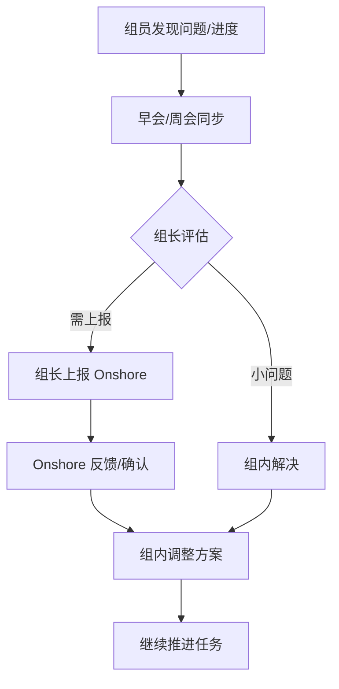

+++
title = '小组 SOP'
date = 2025-09-23T10:00:00+08:00
categories = ['others']
tags = ['sop']
+++

## 团队背景

- **团队规模**：5 人小组  

- **职责范围**：软件与系统的开发、测试、上线全流程  

- **开发模式**：以 Waterfall 流程为主，案件规模 3～20 人月不等，团队需同时并行交付多个中小规模案件  

- **协作方式**：  
  - 与 **Onshore 团队（东京现场）** 密切合作  
  - Onshore 负责客户沟通与成果验收，我方 Nearshore 团队负责交付作业，**需定期共享整体作业进度**  
  
- **团队构成**：  
  
  - 组长（全栈开发 + 设计经验，组内唯一能独立完成全流程）  
  - 组员a（老员工，熟悉业务，比起开发更擅长测试，与组长一定程度互补）  
  - 组员b（新员工，主要擅长后端开发，正在熟悉交付流程） 
  - 组员c（新员工，主要擅长文档，正在熟悉交付流程） 
  - 组员d（新员工，兼职PMO，零经验，正在熟悉测试）  
  
- **团队现状**： 

  | 角色  | 当前主要职责           | 经验 / 特长          | 下一步成长方向              |
  | ----- | ---------------------- | -------------------- | --------------------------- |
  | 组长  | 全栈开发、设计、全流程 | 设计、开发、障害定位 | 保证交付质量 / 提升交付规模 |
  | 组员a | 测试、业务             | 测试、业务           | 测试、设计、全流程          |
  | 组员b | 后端开发               | 新人、后端           | 后端开发、设计、全流程      |
  | 组员c | 文档编写               | 新人、文档           | 后端开发、设计、全流程      |
  | 组员d | PMO、测试              | 新人、PMO            | 待定                        |

## 1. 日常运作 SOP

### 每周：跟踪案件整体

- **频率**：每周第一个工作日 9:15–9:30
- **会前准备**：每人准备 3 分钟汇报（上周重点 / 卡点 / 需协助 / 本周计划） 
- **会议流程**： 
  1. 各案件的信息同步（15%）
  2. 关键问题聚焦（70%）
  3. 决策/行动项（15%）
- **会议纪要**：会后 1 小时内输出，包含每个人的任务 & 截止时间（DDL） 

### 每日：跟踪每个任务的分配与完成情况

- **频率**：除周会外的每日 9:15–9:30（通常情况 10 分钟内）
- **进度更新**：协作工具更新 
- **任务下达要求**：背景、交付物、责任人、优先级、DDL
- **风险上报**：发现延期或 Bug → 及时在会中报告 → 组长评估是否需上报 Onshore 
- **任务验收**：各交付节点的milestone，责任人（案件担当）提交 → 组长验收 → Onshore 确认 

### 汇报模板

- **周报**：详细（量化成果、一周计划、需支持点）  
- **日报**：简短（完成任务、风险/问题）  
- **反馈**：关注各交付节点的milestone，如果战线较长则以每周五为小节点，早会将各案件的进度交至组长

## 2. 协作与风险管理 SOP

### 跨部门协作

- **接口人制度**：明确 Onshore 对接人 （明确相关系统的责任人，找不到就找 Onshore 对接人）
- **协作需求单**：包含背景、目标、交付要求、完成时间、接口约定、责任方...
- **沟通节点**：案件启动 / 各节点检查 / 交付后复盘 / 重点问题的过程记录与存档

### 问题与风险

- **问题升级机制**：
  - 小问题：组内解决
  - 延期风险 / 重大 Bug：发现之后及时报告组长 → 如确定则 **1 天内**反馈给 Onshore
  - 关键问题 / 核心问题：Onshore 管理者双向确认后升级

## 3. 人员成长 SOP

### 新人培养

- **入组前**：准备账号 / 开发环境 / 学习资料  
- **Day 1**：互相熟悉 + mentor带领熟悉权限与流程  
- **Week 1**：学习核心业务 SOP、文档 / 代码阅读、测试演练  
- **Month 1**：小任务演练 → 标准说明 → 反馈收集  

### 一对一沟通

- **频率**：每两周 30–45 分钟
- **沟通框架**：
  - 整体情况描述（10%）
  - 倾听与提问（70%）——进展、挑战、学习目标
  - 反馈与指导（15%）——具体行为 + 建议
  - 目标确认（5%）——下一阶段计划
- **记录**：关键信息与行动项需文档化

### 成果反馈

- **日常反馈**：行为发生后 24 小时内反馈
- **季度反馈**：采用 **SBI 模型**
  - Situation（情境）
  - Behavior（行为）
  - Impact（影响）

## 要点总结

1. **小团队 + 多项目并行** → 流程要轻量化，重在快速同步
2. **Onshore 信息对称** → 进度跟踪与风险上报 SOP 必须执行到位
3. **核心成员单点风险** → SOP 要帮助新人逐步独立，减少对组长的依赖
4. **新人培养机制** → 通过mentor制 + 一对一沟通加速成长
